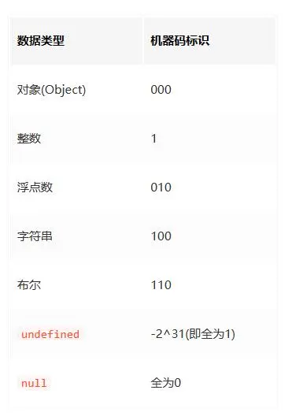

- typeof
  

```js
typeof "123"; // string
typeof 123; // number
typeof NaN; // number
typeof undefined; // undefined
typeof null; // object
typeof []; // object
typeof false; // boolean
typeof Symbol("k"); // symbol
```

- instanceof
  > 检测对象是否为该构造函数的实例

```js
[] instanceof Array; // true

1 instanceof Number; // false
NaN instanceof Number; // false
new Number() instanceof Number; // true

let obj = {};
obj instanceof Object; // false

function Person(name = "ll") {
  this.name = name;
}
let p1 = new Person();
p1 instanceof Person; // true
```

- constructor
  > 根据对象的构造函数来推断类型

```js
function Person(name = "ll") {
  this.name = name;
}
let p1 = new Person();
p1.constructor === Person; // true

[].constructor === Array; // true
```

- Object.prototype.toString

```js
console.log(Object.prototype.toString.call([])); // [object Array]
console.log(Object.prototype.toString.call(1)); // [object Number]
console.log(Object.prototype.toString.call(NaN)); // [object Number]
console.log(Object.prototype.toString.call(true)); // [object Boolean]
console.log(Object.prototype.toString.call(undefined)); // [object Undefined]
console.log(Object.prototype.toString.call(null)); // [object Null]
console.log(Object.prototype.toString.call("2")); // [object String]
console.log(Object.prototype.toString.call(Symbol("1"))); // [object Symbol]
console.log(Object.prototype.toString.call({})); // [object Object]
console.log(Object.prototype.toString.call(/^1/)); // [object RegExp]
console.log(Object.prototype.toString.call(new Date())); // [object Date]
console.log(Object.prototype.toString.call(function fn1() {})); // [object Function]

function Person(name) {
  this.name = name;
}
let p = new Person("huang");
console.log(Object.prototype.toString.call(p)); // [object Object]
```
