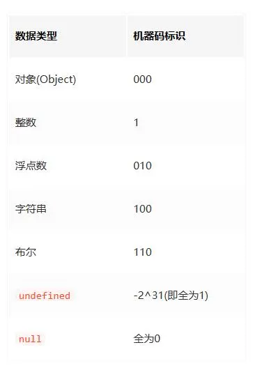

- `typeof` 操作符 根据存储时标记不同机器码标识来判断
  

```js
typeof null; // object
typeof undefined; // undefined
typeof 1; // number
typeof "a"; // string
typeof true; // boolean
typeof new Number(1); // object
typeof NaN; // number
typeof Symbol("红色"); // symbol
typeof (() => {}); // function
```

- `Object.prototype.toString.call()`

  - 各类型判断

    ```js
    console.log(Object.prototype.toString.call([])); // [object Array]
    console.log(Object.prototype.toString.call(1)); // [object Number]
    console.log(Object.prototype.toString.call(NaN)); // [object Number]
    console.log(Object.prototype.toString.call(true)); // [object Boolean]
    console.log(Object.prototype.toString.call(undefined)); // [object Undefined]
    console.log(Object.prototype.toString.call(null)); // [object Null]
    console.log(Object.prototype.toString.call("2")); // [object String]
    console.log(Object.prototype.toString.call(Symbol("1"))); // [object Symbol]
    console.log(Object.prototype.toString.call({})); // [object Object]
    console.log(Object.prototype.toString.call(/^1/)); // [object RegExp]
    console.log(Object.prototype.toString.call(new Date())); // [object Date]
    console.log(Object.prototype.toString.call(function fn1() {})); // [object Function]

    function Person(name) {
      this.name = name;
    }
    let p = new Person("huang");
    console.log(Object.prototype.toString.call(p)); // [object Object]
    ```

    - 封装数据类型判断的方法

    ```js

    ```

- `instanceof` 判断该对象是否为某一构造函数的实例

```js
[] instanceof Array; // true
1 instanceof Number; // false
NaN instanceof Number; // false
new Number() instanceof Number; // true

let obj = {};
obj instanceof Object; // false

function Person(name = "ll") {
  this.name = name;
}
let p1 = new Person();
p1 instanceof Person; // true
p1 instanceof Function; // false;
Person instanceof Function; // true
```

- `constructor`

```js
function Person(name = "ll") {
  this.name = name;
}
let p1 = new Person();
p1.constructor === Person; // true

[].constructor === Array; // true
```
